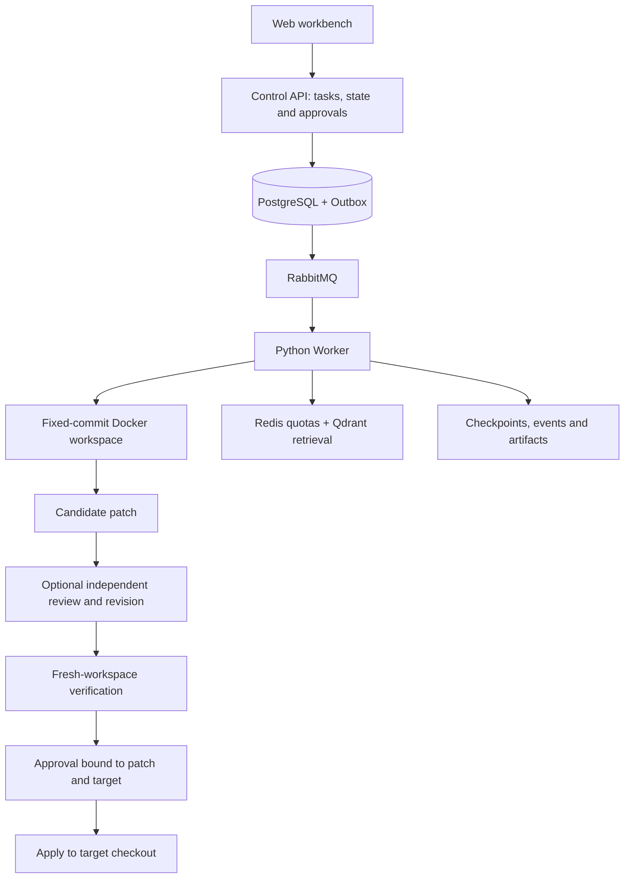

# RepoFix

English | [简体中文](README.zh-CN.md)

A repository-repair workbench that runs coding agents at a fixed Git commit, produces candidate patches, verifies them independently and supports approval-bound delivery to a target checkout.

`Next.js · TypeScript · NestJS · Fastify · Prisma · PostgreSQL · RabbitMQ · Python · Docker · Redis · Qdrant`

## Capabilities

| Capability | Behavior |
| --- | --- |
| Fixed-version tasks | Accepts public GitHub or registered repository snapshots, a commit, task description and allowed paths |
| Sandboxed repair | Runs inspection, edits and development tests in Docker; exports multi-file Git patches |
| Independent verification | Replays a candidate in a fresh workspace and runs the same tests on base and candidate |
| Reliable scheduling | Uses Outbox dispatch, leases, execution generations and checkpoints to handle duplicates and interruptions |
| Context management | Supports full, compact and managed modes, versioned retrieval, scoped rules and explicit memory |
| Independent review | Produces structured findings and bounded revisions; candidate changes invalidate review evidence |
| Version-bound approval | Binds action approval to the workspace and delivery approval to the patch and target fingerprints |
| Workbench and observability | Shows events, source/candidate comparison, findings, verification evidence and optional OTLP traces |
| SWE-bench integration | Exports attempt-bound predictions and imports official harness results |

## Repair workflow



Execution, verification and delivery have separate states. Snapshot verification requires a nonempty patch, assertion failures on the base without test-loading errors, and the candidate passing the same unskipped tests. SWE-bench `resolved` results come from the official harness.

## Workbench

- Create tasks from built-in scenarios or fixed repository versions.
- Inspect source versions, events, candidate diffs and independent test results.
- Read review findings and approve or reject version-bound actions.
- Replay stored candidates and inspect checkpoints without another model run.
- Browse history using stable pagination and Run ID lookup.

The `/showcase` entry provides three built-in multi-file scenarios with deterministic execution. The regular workbench supports configured real-model runs. Both modes expose verification evidence.

## Evaluation results

| Evaluation | Result |
| --- | --- |
| SWE-bench Verified Mini, 50 distinct first attempts | 33/50 resolved by the official harness |
| Adapted Aider Polyglot Python, 34 tasks | Public candidate tests: 33/34 passed; platform strict verification: 22/34 passed |
| Repeated custom cross-file tasks | Full, compact and managed each passed 6/9 independent verifications |
| Automated checks | Python: 106 passed under each of two model policies; Node: 6 tests passed; API/Web types and builds passed |

Mini runs used `deepseek-flash`, with mixed call limits: 60 for 30 tasks and 100 for 20 tasks. Reviewer pairs and retries are excluded from those 50 first attempts. It is a third-party 50-task subset, not a Verified 500 leaderboard result. Aider scores use different criteria. These context experiments did not establish a success-rate or token advantage for managed mode, or a consistent quality improvement from the Reviewer.

## Quickstart

Requires Git, Docker, Node.js 22 and uv. Clone with submodules, then initialize the deterministic scenarios:

```sh
git clone --recurse-submodules https://github.com/FionnLeee/RepoFix.git
cd RepoFix
uv sync --frozen
uv run python scripts/configure.py
uv run python scripts/prepare_baselines.py
docker pull python:3.12-slim
docker compose up -d --build --scale worker=2
```

- Workbench: <http://localhost:3100>
- Built-in scenarios: <http://localhost:3100/showcase>
- API health: <http://localhost:3101/health>

Default setup uses deterministic scenarios with real-model execution disabled. Configuration fields are listed in [`.env.example`](.env.example). The current deployment uses a shared workspace and local artifact storage; snapshot tasks support bounded UTF-8 text repositories, while image tasks use prepared repository images.

## Verification

```sh
uv run pytest -m "not docker" -q
uv run ruff check services scripts
uv run python scripts/smoke.py
```

Smoke requires a running isolated stack and uses deterministic execution. GitHub Actions checks Python and Node behavior, API/Web builds, the default Docker stack and authenticated HTTPS deployment.

## Upstream

RepoFix uses [mini-swe-agent](https://github.com/SWE-agent/mini-swe-agent) 2.4.6, pinned as a submodule at `04d809ceab9df28f9adaed044884180159172930`, for the agent loop, model integration and trajectory format. RepoFix adds the control plane, Worker protocol, scheduling, context services, independent verification, approval-bound delivery and web workbench. The upstream [MIT license](https://github.com/SWE-agent/mini-swe-agent/blob/04d809ceab9df28f9adaed044884180159172930/LICENSE.md) is retained in the submodule.
