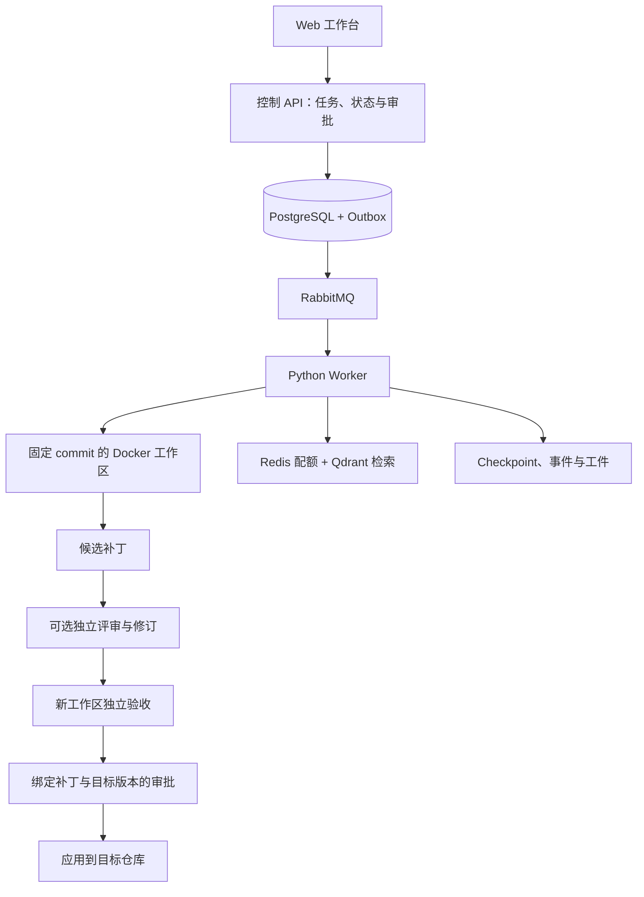

# RepoFix

[English](README.md) | 简体中文

面向代码仓库修复的 Agent 工作台：在固定 Git commit 上运行编码 Agent，生成候选补丁，通过独立验收后，以版本绑定审批交付到目标仓库。

`Next.js · TypeScript · NestJS · Fastify · Prisma · PostgreSQL · RabbitMQ · Python · Docker · Redis · Qdrant`

## 核心功能

| 功能 | 实际行为 |
| --- | --- |
| 固定版本任务 | 接收公开 GitHub 或已登记仓库快照、commit、任务描述与允许路径 |
| 沙箱修复 | 在 Docker 中检查代码、修改与运行开发测试，导出多文件 Git 补丁 |
| 独立验收 | 在新工作区重放候选，分别对基线与候选运行相同测试 |
| 可靠调度 | 使用 Outbox、租约、执行代次与 checkpoint 处理重复消息和中断 |
| 上下文管理 | 支持 full、compact、managed 模式，版本化检索、目录规则与显式记忆 |
| 独立评审 | 生成结构化意见并进行有限修订，候选变化后旧评审证据失效 |
| 版本绑定审批 | 工具动作绑定工作区版本，最终交付绑定补丁与目标文件指纹 |
| 工作台与可观测性 | 展示事件、源码与候选对比、评审意见、验收证据和可选 OTLP trace |
| SWE-bench 接入 | 导出绑定具体尝试的预测，并导入官方 harness 结果 |

## 修复流程



执行、验收和交付分别记录状态。快照验收要求补丁非空、基线出现断言失败且没有测试加载错误、候选通过相同且未跳过的测试。SWE-bench 的 `resolved` 由官方 harness 判定。

## 工作台

- 从内置场景或固定仓库版本创建任务。
- 查看源码版本、事件、候选 diff 和独立测试结果。
- 查看评审意见，批准或拒绝版本绑定的工具动作。
- 无需再次调用模型即可重放候选、检查 checkpoint。
- 通过稳定分页和 Run ID 查询任务历史。

`/showcase` 提供三个内置多文件场景的确定性执行入口；常规工作台支持已配置的真实模型运行，两种模式均展示验收证据。

## 评测结果

| 评测场景 | 结果 |
| --- | --- |
| SWE-bench Verified Mini，50 个不同任务的首次尝试 | 官方 harness 判定 33/50 resolved |
| Aider Polyglot Python 34 题适配评测 | 公开候选测试 33/34 通过；平台严格验收 22/34 通过 |
| 重复自建跨文件任务 | full、compact、managed 各 6/9 通过独立验收 |
| 自动化检查 | 两种模型策略下分别 106 项 Python 测试通过；Node 6 项通过；API/Web 类型与构建检查通过 |

Mini 修复评测使用 `deepseek-flash`，调用上限为 30 题 60 次、20 题 100 次，Reviewer 配对与重试不计入这 50 次首次尝试。这是第三方 50 题子集，不能等同于 Verified 500 榜单成绩。Aider 两项结果使用不同验收标准；上下文对照未证明 managed 的成功率或 token 优势，也未证明 Reviewer 带来稳定质量提升。

## 快速开始

需要 Git、Docker、Node.js 22 和 uv。包含子模块克隆后，初始化确定性场景：

```sh
git clone --recurse-submodules https://github.com/FionnLeee/RepoFix.git
cd RepoFix
uv sync --frozen
uv run python scripts/configure.py
uv run python scripts/prepare_baselines.py
docker pull python:3.12-slim
docker compose up -d --build --scale worker=2
```

- 工作台：<http://localhost:3100>
- 内置场景：<http://localhost:3100/showcase>
- API 健康检查：<http://localhost:3101/health>

默认使用确定性场景，真实模型执行关闭，配置字段见 [`.env.example`](.env.example)。当前部署采用共享工作区和本地工件存储；snapshot 任务面向有界 UTF-8 文本仓库，image 任务使用预先准备的仓库镜像。

## 验证方式

```sh
uv run pytest -m "not docker" -q
uv run ruff check services scripts
uv run python scripts/smoke.py
```

smoke 需要隔离栈运行，采用确定性执行。GitHub Actions 覆盖 Python 与 Node 行为、API/Web 构建、默认 Docker 栈和 HTTPS 部署认证。

## 上游基础

RepoFix 使用 [mini-swe-agent](https://github.com/SWE-agent/mini-swe-agent) 2.4.6，子模块固定在 `04d809ceab9df28f9adaed044884180159172930`，复用其 Agent 循环、模型接入与轨迹格式。RepoFix 增加了控制端、Worker 协议、调度、上下文服务、独立验收、版本绑定交付与 Web 工作台。上游 [MIT 许可证](https://github.com/SWE-agent/mini-swe-agent/blob/04d809ceab9df28f9adaed044884180159172930/LICENSE.md) 保留在子模块中。
