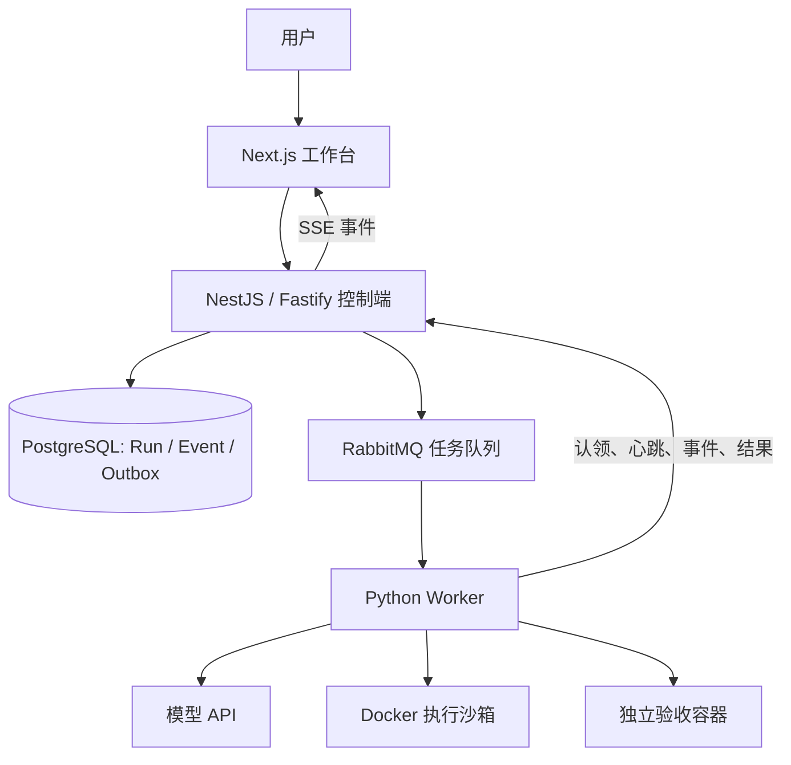

# RepoPilot 项目二学习复盘与面试笔记

更新日期：2026-09-16。对应首版 M0/M1；编写时实现基线为 `4a009fb`。

适用对象：刚接触项目，希望先看懂演示，再读懂主要代码，最后能解释设计取舍。本文中的面试回答是练习模板，请结合自己实际阅读、修改和验证的经历表达。

## 1. 先用一分钟认识项目

RepoPilot 是一个面向代码修复任务的 Agent 工作台：接收问题，让模型在隔离环境里读代码、执行命令、修改代码，再把补丁和测试结果交给用户。

当前版本只处理预先准备的 Python 价格计算样例。它已打通网页、任务管理、消息队列、Agent 执行、Docker 沙箱、独立验收和结果展示，但还不能输入任意 GitHub 仓库直接修复。

项目的用途是承接程序员修 Bug 时的一部分操作，并保留过程证据。用户最终关注三件事：改了什么、为什么认为改对了、失败时能不能查到原因。

模型负责根据当前上下文决定下一步；Agent 程序负责反复调用模型、解析动作并执行工具。模型 API 本身不会自动修改本机文件，真正的命令执行发生在我们提供的工具环境里。

### 当前能力与后续计划

| 状态 | 内容 |
| --- | --- |
| 已实现 | 固定样例任务、真实模型和确定性演示、两个 Worker、任务事件与 SSE、补丁下载、取消、Docker 隔离、独立测试验收 |
| 已实现的可靠性基础 | 幂等创建、事务 Outbox、条件认领、运行代次、租约、事件去重 |
| 下一轮已安排，尚未实现 | 指定仓库与固定 commit、多文件修改、可复现验收、小规模基线任务集 |
| 后续计划 | 上下文压缩、项目记忆、审批、恢复、独立 Reviewer、SWE-bench、OTel、对象存储 |
| 仅有启动配置 | Qdrant、Redis 的 extended Compose profile；尚无业务集成 |

## 2. 看懂当前演示：AI 修的究竟是什么

### 2.1 业务问题

一件商品 100 元，买两件，优惠 20%，应付 `100 × 2 × 0.8 = 160` 元。这里的 20 表示优惠百分比，也就是打八折。

原代码把它当成优惠金额：

```python
def discounted_total(price, quantity, discount):
    return price * quantity - discount
```

所以算出了 `100 × 2 − 20 = 180` 元。任务要求模型修复百分比计算、将结果保留两位小数，并拒绝 0～100 以外的折扣。

### 2.2 真实运行发生的步骤

1. 平台在沙箱里放入 `pricing.py` 和开发测试 `test_pricing.py`。
2. 模型选择列出文件，然后读取源码和测试，看到预期结果是 160。
3. 模型通过命令写入修复后的代码，并运行两项开发测试，两项通过。
4. 模型发出约定的完成命令，平台提取候选 `pricing.py` 并生成 diff。
5. 平台新建验收容器，先验证原代码失败，再写入候选代码，执行六项固定验收测试。
6. 原代码验收失败、候选代码验收通过且补丁非空，任务被标记成功。

这次真实轨迹没有显示“修改前先运行开发测试”的动作；修改前失败的证据来自平台的基线验收。不要把预设演示的动作顺序套在真实运行上。

实际候选代码：

```python
def discounted_total(price, quantity, discount):
    if discount < 0 or discount > 100:
        raise ValueError("discount must be between 0 and 100")
    return round(price * quantity * (1 - discount / 100), 2)
```

| 验收输入：单价、数量、优惠百分比 | 预期 |
| --- | --- |
| `100, 2, 20` | `160` |
| `17, 3, 0` | `51` |
| `17, 3, 100` | `0` |
| `19.99, 3, 15` | `50.97` |
| `10, 1, -1` | 抛出 `ValueError` |
| `10, 1, 101` | 抛出 `ValueError` |

这里使用 float 和 round 满足样例要求；若扩展为真实支付系统，还应明确 Decimal 或整数分、舍入规则和输入约束，不能把这个教学函数视为完整财务实现。

### 2.3 页面上的内容怎么读

- 任务状态：是否排队、执行中、验收中、成功、失败或取消。
- 轨迹／事件：模型调用记录、执行的命令和命令结果。它是可观察的操作记录，不是完整的模型内部思考。
- Diff：`-` 行是原来的代码，`+` 行是候选代码。它回答“到底改了什么”。
- 验收：六项测试及执行结果。它回答“当前验收条件是否满足”。
- 模型调用次数和 token：资源消耗记录；6 次调用不等于 6 项测试。

演示分两种：`demo` 使用固定动作和预设修复，不调用真实模型；`live` 由真实模型生成动作。前者用于稳定检查系统链路，后者用于观察 Agent 的实际表现。

### 2.4 三分钟演示讲稿

“这里有一个价格函数，把优惠 20% 错算成减 20 元，导致 200 元订单算成 180 元。现在展示一次已经完成的真实模型任务。”

“轨迹里可以看到模型先查看文件，再读代码和开发测试，然后写入百分比计算公式并运行测试。Diff 里能看到新增了折扣范围校验，核心计算改成乘以剩余比例。”

“模型提交候选文件后，平台另外启动验收容器。这里六项测试覆盖普通优惠、零优惠、全额优惠、舍入和非法范围。原代码不通过，候选代码通过，所以平台把任务标记为成功。”

“目前这证明了一个固定样例的执行闭环。下一步会支持指定仓库和多文件任务，用固定任务集评估成功率与成本。”

真实模型历史任务：[打开运行](http://localhost:3100/?run=1f4a64f7-4750-4418-bff8-50dd495678cb)。需要本机服务和对应数据库记录仍在；脱敏结果另见 [live-smoke.json](evidence/live-smoke.json)。

## 3. 架构：每一层为什么存在



| 组件 | 职责及选择理由 | 当前取舍 |
| --- | --- | --- |
| Next.js / TypeScript | 提供任务操作和结果界面，便于共享类型习惯与组件开发 | 首版 UI 较简单，尚无 Monaco；不声称 Next.js 本身带来已测量的性能提升 |
| NestJS / Fastify | 组织 HTTP 接口、输入校验、任务协调逻辑 | 首版主要逻辑集中于 main.ts，后续应按职责拆分 |
| Prisma / PostgreSQL | 类型化数据库访问、事务、唯一约束与条件更新 | 并发正确性依赖数据库约束和事务，不能仅依靠 TypeScript 类型 |
| RabbitMQ | 把耗时任务从 HTTP 请求中移开，分发给 Worker | 引入了重复投递、确认与故障恢复问题，需要应用层处理 |
| Python Worker | 复用 Python Agent 生态和 mini-swe-agent，调用模型与 Docker SDK | 跨语言增加协议与部署成本，因此需要字段校验和 schema_version |
| Docker | 提供独立工作目录与资源边界，运行候选代码 | Worker 拥有 Docker 管理权限，必须作为可信进程保护 |

这里 TypeScript 负责业务状态，Python 负责 Agent 执行。Worker 通过内部认证接口提交状态，不直接连接业务数据库。这能集中管理认领与状态更新规则，但也增加了对控制端可用性的依赖。

两个 Worker 是两个任务消费者，并不是两个模型围绕同一问题协同讨论。当前每个 Worker 的 `prefetch=1`，每次最多持有一条未确认任务消息。

### 数据库最值得记住的三张表

- `Run`：任务本身。包括状态、幂等键、Worker、运行代次、租约截止时间、取消标记、最终结果。
- `Event`：任务发生过的事件。`(runId, key)` 唯一，用于防止同一事件重试后重复写入；自增 id 用作展示顺序与续传游标。
- `Outbox`：等待发布到 RabbitMQ 的任务消息记录。与创建任务放在同一数据库事务中。

事件表支持查看历史过程，但目前不能只靠事件完整重建并恢复执行，不应宣称已经实现完整 Event Sourcing。

## 4. Agent 的基本逻辑与开源边界

Agent 循环可以写成下面的概念伪代码：

```python
messages = [系统规则, 用户任务]
while 未结束且未超过预算:
    response = 调用模型(messages)
    action = 解析命令(response)
    observation = 在沙箱执行(action)
    messages += [response, observation]
```

工具执行结果会进入下一次调用的上下文，所以模型可以根据“文件内容、报错、测试输出”决定后续动作。当前使用文本命令协议：模型输出约定的 fenced command，适配器在沙箱执行。

结束动作是约定的 `echo COMPLETE_TASK_AND_SUBMIT_FINAL_OUTPUT`。平台识别它之后开始交付候选和独立验收；模型说完成，不等于任务已通过验收。

| 复用 mini-swe-agent | RepoPilot 新增实现 |
| --- | --- |
| DefaultAgent 执行循环、轨迹格式、基础步数和时间边界 | 网页、业务状态管理、队列分发与跨语言 Worker 协议 |
| LitellmTextbasedModel 模型接入 | 模型调用事件、受限 Docker 环境适配、取消检查 |
| DeterministicModel 预设动作能力 | 固定样例、候选文件提取、独立验收与补丁展示 |

上游是 mini-swe-agent 2.4.6，MIT，以 submodule 固定提交，未直接修改。面试时可以说“基于开源 Agent 内核实现任务执行平台”，不应说从零原创了整个 Agent 框架。项目贡献也不自动等于自己独立编写的全部代码：需要能说明自己实际参与的设计、阅读、调试和验证过程。

## 5. 面试重点：可靠执行为什么需要这些机制

### 5.1 幂等：用户点两次会不会运行两次

请求携带 `requestKey`，数据库对它设置唯一约束。同一个 key 的重复请求得到同一 Run。并发情况下不能只“先查有没有”，因为两次查询可能都查不到；最终依靠唯一约束，并捕获冲突取回已有任务。相同 key 却切换 demo/live 会返回冲突。

幂等范围取决于 key：使用不同 key 创建的任务不会自动合并。

### 5.2 Outbox：数据库成功了，消息没发出去怎么办

如果先插入任务再直接发消息，中间进程崩溃，就会出现“任务存在但无人执行”。本项目把 Run、初始 Event 和 Outbox 在同一个数据库事务里写入，再由发布器扫描 Outbox、发送消息、等待 broker 确认并标记发布。

如果发送成功后、标记前崩溃，重启后仍可能再次发送。因此 Outbox 并没有消除重复投递；消费者还需要幂等认领。当前发布器为单 API 进程，broker 断连后需要重启 API，不能说已经实现高可用发布。

### 5.3 认领、运行代次、租约各解决什么

- 条件认领：只有 `QUEUED` 且未取消的任务可以原子更新为 `RUNNING`，避免重复消息引发两次有效认领。
- 运行代次 `generation`：每次成功认领递增。Worker 上报必须携带当前代次，旧执行者的请求会被拒绝。
- 租约 `leaseUntil`：当前设置为 45 秒，Worker 约每 8 秒发心跳，成功步骤也会续租。过期后平台标记 `INTERRUPTED`。
- 所有权检查：上报时同时验证 Worker、代次和租约；不能仅相信消息队列已经把任务分配好了。

当前过期后不自动恢复，也不自动让新 Worker 继续执行。代次只是为所有权校验提供基础，不代表恢复功能已经完成。

### 5.4 为什么不能声称 exactly-once

消息可能重复投递，网络超时也不能证明对方没收到。当前做法是接受重复的可能，靠唯一键、条件更新、代次校验和事件去重约束业务状态。不能据此保证所有工具副作用严格只发生一次。

将来如果允许提交 PR、发布包等外部操作，还需要针对具体操作设计幂等标识和恢复策略。

### 5.5 SSE 与取消

前端主要接收任务事件，SSE 足够满足单向更新；创建和取消仍用普通 HTTP。事件来自数据库，客户端可以携带 last-event-id 或 after 游标读取后续事件。当前服务端约每 800ms 查询数据库，这有实现简单的好处，也存在并发连接下的数据库轮询成本。

取消会先记录 `cancelRequested`。排队任务可立即标记取消；运行任务通过心跳／步骤响应得知取消，并在工具边界检查。正在执行的命令受 25 秒工具期限和终止宽限约束，模型请求仍需等待请求期限，不能承诺按下按钮立即停止。

## 6. 面试重点：沙箱和验收

### 6.1 为什么要隔离执行

模型可能生成错误命令，仓库代码本身也可能不可信。系统提示中的要求不能替代执行环境约束。

当前执行容器使用：非 root 用户、无网络、只读根文件系统、临时可写工作目录、256MB 内存、约 1 CPU、64 PID 上限、移除 capabilities 和禁止新增权限。模型密钥和 Docker socket 不传入该容器。工具结果最多回传 16KB，单条命令有执行期限。

只读根文件系统并不意味着完全不能写文件：`/workspace` 和 `/tmp` 是明确配置的可写 tmpfs。

调用模型发生在 Worker，模型要求执行的命令发生在另建的沙箱，因此沙箱断网不影响 Worker 调用模型。Worker 仍持有模型配置和 Docker 管理权限，属于可信边界；容器也共享内核，不能承诺绝对安全。Worker 被强杀后可能遗留沙箱，自动孤儿清理尚未实现。

### 6.2 为什么还要独立验收

Agent 可能只改到“自己看过的测试能通过”，也可能修改开发测试。当前平台只提取 `pricing.py`，在新容器里使用事先准备的验收测试，降低开发环境残留状态和测试被改动带来的误判。

候选读取使用 `O_NOFOLLOW`、普通文件和大小检查，防止把符号链接或特殊文件当作补丁源码。固定路径的实现尚不能直接推广为任意仓库，需要新的路径边界与多文件提取设计。

当前成功条件：补丁非空、原代码验收返回非零、候选返回零且输出包含六项测试标志。这适合首版固定样例，但返回码加文本标记不是通用防作弊验收协议，未来应采集更结构化的测试结果并评估测试污染风险。

独立测试验收与独立 Reviewer 不同。前者执行测试；后者计划用额外审查流程检查代码问题，目前尚未实现。即使全部测试通过，也只能说明满足已覆盖条件，不能证明没有其他 Bug。

## 7. 已有证据、调试经历和可讲的结果

### 7.1 结果口径

| 证据 | 可以得出的结论 | 不能扩大的结论 |
| --- | --- | --- |
| Next.js、NestJS 构建和 Python 检查通过 | 首版能构建并通过当前检查 | 所有场景均正确 |
| 六个并发同 key 请求返回同一 run | 已验证该并发创建场景的幂等 | 完整生产压测或无限并发 |
| 两个 Worker 各处理一条并发演示 | 已验证双消费者工作 | 吞吐提高两倍 |
| 认领、旧代次、取消、租约和 SSE 验证 | 这些协议边界有运行证据 | 已具备断点恢复与高可用 |
| 一个真实样例修复通过 | 能完成该样例的自主修改与验收 | SWE-bench 成绩或 100% 成功率 |

首轮真实运行：模型 `deepseek-v4-flash-0731`，6 次调用，provider 返回输入 2,721 token、输出 695 token。冒烟脚本总耗时 22.52 秒，包含并发检查和轮询，不能称为纯模型延迟或 P95。未配置价格表，费用未知。原始证据见 [VALIDATION.md](VALIDATION.md) 和 [evidence](evidence)。

### 7.2 一个值得亲自复现的调试案例

问题：在只读根文件系统与 tmpfs 工作目录的组合下，原先尝试的 Docker archive 写入／读取方式没能完成样例初始化与候选取回。

处理：初始化改为容器内非 root 进程写入允许的文件；候选读取改为容器内隔离 Python 读取固定文件，并检查符号链接、文件类型和大小，以 base64 返回。

验证：加入实际 Docker 测试，检查沙箱约束、文件提取与符号链接拒绝，修正测试中对 DockerClient 上下文管理的错误假设，再复测。

学到的事情：安全配置会改变文件传输方式的可用性；不能为了让初始化方便就移除隔离约束。只有自己读过相关代码和验证过行为之后，才适合在面试中当作自己的调试经历展开。

## 8. 从哪里读代码，怎样快速上手

按下面顺序读，第一遍不需要逐行理解整个仓库。

| 顺序 | 文件 | 读完应能回答 |
| --- | --- | --- |
| 1 | [fixture.py](../services/agent-worker/repopilot/fixture.py) | 输入、Bug、开发测试和验收测试分别是什么？ |
| 2 | [runtime.py](../services/agent-worker/repopilot/runtime.py) | execute_run 如何创建环境、运行 Agent、取补丁、独立验收？ |
| 3 | [worker.py](../services/agent-worker/repopilot/worker.py) | 消息如何认领，心跳、取消和完成确认在哪里？ |
| 4 | [schema.prisma](../apps/control-api/prisma/schema.prisma) | 三张表及唯一约束是什么？ |
| 5 | [main.ts](../apps/control-api/src/main.ts) | create、tick、claim、step、stream 分别负责什么？ |
| 6 | [page.tsx](../apps/web/app/page.tsx) | 页面如何创建任务、接收事件、显示结果？ |
| 7 | [检查脚本](../scripts) 与 [Python 测试](../services/agent-worker/tests) | 每条工程结论对应哪项验证？ |
| 8 | vendor/mini-swe-agent 的 DefaultAgent | 哪些行为来自上游，扩展点在哪里？ |

### 本机练习顺序

1. 在仓库目录执行 `docker compose ps`，认识 web、api、postgres、rabbitmq、worker。
2. 打开 [工作台](http://localhost:3100)，先看已有真实任务，再运行一次标记明确的确定性演示。
3. 对着 Diff 手算 `100 × 2 × 0.8`，解释两项开发测试与六项验收测试的区别。
4. 找到 `Run.requestKey`、claim 中的条件更新、step 中的所有权校验，对照下面的面试问答口述。
5. 阅读现有故障检查脚本，理解重复认领和旧代次为何被拒绝。还不熟悉时先读，不随意停止容器或删除数据。

需要重新启动时，按 [README](../README.md) 配置依赖、submodule 和本地环境。常用检查：

```bash
npx pnpm@10.17.1 build
uv run ruff check services scripts
uv run pytest
uv run python scripts/smoke.py
```

默认 smoke 使用确定性演示。`--live` 会调用真实模型并产生资源消耗。密钥仅保存在被忽略的本地配置，不能贴入学习笔记、截图或提交记录。Git 保存源码与脱敏证据，不备份本机数据库和 runtime 工件。

## 9. 面试表达模板与追问

### 9.1 约一分钟的项目介绍

“RepoPilot 是我在学习和开发的 Coding Agent 工作台，基于 mini-swe-agent 扩展。当前已完成固定代码修复样例的全链路：Next.js 提交任务，NestJS 和 PostgreSQL 管理状态，通过 RabbitMQ 分发给 Python Worker，模型在 Docker 沙箱内读写代码，最后在独立环境验收补丁。

我重点关注执行过程的可靠性与可验证性，包括幂等创建、事务 Outbox、条件认领、租约和代次校验，以及受限沙箱和独立测试。当前真实模型已修复一个价格计算样例并通过六项验收。下一阶段会扩展到固定版本的真实仓库与多文件任务，再用基线任务集衡量上下文压缩的效果。”

### 9.2 高频追问卡片

| 问题 | 回答主线 |
| --- | --- |
| 为什么不在 HTTP 请求里直接跑 Agent？ | 模型执行耗时长，需要排队、独立扩展 Worker 和记录任务状态；队列引入的重复投递由业务协议处理。 |
| 为何同时用 TypeScript 和 Python？ | TypeScript 组织工作台与业务控制，Python 复用 Agent 生态；代价是跨语言契约与运维复杂度。 |
| 加 RabbitMQ 就不会丢任务了吗？ | 不会自动保证。说明 Outbox、broker confirm、消息确认时机与认领规则，并承认当前重连与恢复限制。 |
| Worker 崩溃后怎么办？ | 租约过期标记 INTERRUPTED；当前没有自动恢复。不能把消息重投等同于恢复模型上下文和文件状态。 |
| 模型改测试让自己通过怎么办？ | 只提取允许的源码，在新容器用平台准备的测试验收；当前仍有固定样例和验收协议的局限。 |
| Docker 和提示词哪个负责安全？ | 提示词说明任务，执行边界靠环境约束；可信 Worker 的 Docker 权限仍是需要保护的边界。 |
| 日志截断是不是上下文压缩？ | 当前只是工具输出限长；还没实现摘要式压缩、分层上下文或压缩效果评测。 |
| 为什么选 PostgreSQL？ | 任务状态需要事务、唯一约束和条件更新，当前具体使用点比“数据库更先进”更有说服力。 |
| 你做的原创贡献是什么？ | 按上游／新增表解释系统工程贡献，再举自己实际调试和验证的具体例子。 |
| 这个项目比 TicketPilot 进阶在哪里？ | 本项目重点增加代码执行边界、长任务协调和可验证补丁交付。与项目一比较时，以项目一实际实现为准；压缩、记忆和评测仍是后续增量。 |

### 9.3 当前可用的简历表述

“基于 mini-swe-agent 构建 RepoPilot 代码修复工作台，采用 Next.js、NestJS、PostgreSQL、RabbitMQ 与 Python Worker，完成任务分发、Docker 隔离执行、补丁展示与独立测试验收；实现幂等创建、事务 Outbox、租约与运行代次校验，并验证双 Worker 并发及单个真实模型修复样例。”

不要写“自研完整 Agent 框架”“支持任意仓库”“实现长期记忆与断点恢复”“SWE-bench 成功率达到某值”“生产级高可用”，这些均无当前实现或证据支持。

## 10. 下一轮怎样形成能证明贡献的实验

以下为待实施计划，不属于已交付结果。

### 10.1 指定仓库、多文件与可复现验收

首批选择依赖可控的小型仓库，固定源码 commit、任务说明、运行环境、允许交付路径和独立测试。使用明确的任务清单管理约 5～10 个不同类型的缺陷，包括跨文件调用、输入校验、配置与回归场景。数量是建议起点，需要实际选题后确定。

每个任务应能在修复前稳定复现失败，且有参考修复可验证测试有效性。模型开发阶段可见的测试与最终验收测试要明确区分。候选多文件补丁应在干净的同一 commit 上重新应用，再执行验收。

“可复现”首先指代码与验收环境可重建；真实模型仍可能产生不同输出。镜像应记录 digest、依赖应锁定版本，不能仅保存会变化的镜像标签。

### 10.2 先记录基线，再加入上下文压缩

基线记录：task_id、repo commit、模型及参数、提示词版本、环境版本、补丁、原始与候选测试结果、调用次数、token、总耗时、停止原因。区分代码失败、模型超时、执行失败和环境故障。

加入压缩后，在相同任务集、模型与预算条件下配对比较；记录压缩调用自身的消耗。对有随机性的任务重复运行，公布尝试次数和失败样本。成功率分母应按预先约定的全部有效任务计算，不能悄悄删除失败任务。

压缩摘要优先保留目标、硬约束、已改文件、测试结果、未解问题和下一步；原始轨迹仍单独保存。验证重点是“减少多少 token、是否损失修复成功率、是否忘记约束”，而不是只展示摘要文本变短。

自建基线任务集不等于 SWE-bench。后续接入官方 harness 后，应另行说明数据集版本、任务范围、环境和评分口径。

## 11. 两小时入门与面试前自测

| 时间 | 学习动作 | 产出 |
| --- | --- | --- |
| 0～20 分钟 | 阅读第 1～2 节并看真实任务 | 不看笔记解释 180 元如何变成 160 元 |
| 20～45 分钟 | 对照第 3～4 节和 runtime.py | 画出一次任务的数据流，区分模型、Worker、沙箱 |
| 45～75 分钟 | 读 claim、step、schema | 用重复点击与 Worker 失联解释幂等和租约 |
| 75～100 分钟 | 阅读沙箱和验收代码、现有测试 | 解释隔离边界与独立验收的局限 |
| 100～120 分钟 | 练一分钟介绍、三分钟演示 | 录一段讲解，检查是否误把计划当成果 |

合上笔记后自测：

1. discount=20 为什么是打八折？哪一行代码原来写错了？
2. 为什么有开发测试和独立验收两套测试？成功判定由谁做？
3. Run、Event、Outbox 分别保存什么？
4. 数据库提交后、消息发布前崩溃会怎样？发布后标记前崩溃呢？
5. 两个 Worker 收到同一个 run_id，谁能执行？
6. generation 和 leaseUntil 分别挡住什么错误？
7. 沙箱断网为什么还能使用模型？密钥在哪个进程边界内？
8. 点击取消后为什么不一定立即停止？
9. 哪些代码来自上游，自己实际理解和验证过哪些扩展？
10. 单个样例通过为什么不能写成成功率 100%？

如果某题只能背名词，就回到对应源码，找出具体字段、条件或命令。面试时最有说服力的是“出现什么问题、采用什么机制、怎样验证、还有什么局限”这条完整解释链。

## 12. 后续每轮更新模板

```text
日期与 commit：
这轮解决的具体问题：
修改的模块与选择理由：
复现步骤／失败证据：
验证命令与结果：
与基线相比的变化（无测量则写未测量）：
已知局限：
我现在能独立解释／复现的部分：
下一轮任务：
```

每轮以 [STATUS.md](STATUS.md) 更新能力边界，以 [VALIDATION.md](VALIDATION.md) 和脱敏证据核实结果。不要只累积技术名词，要积累能现场演示、能追到源码、能解释取舍的事实。
