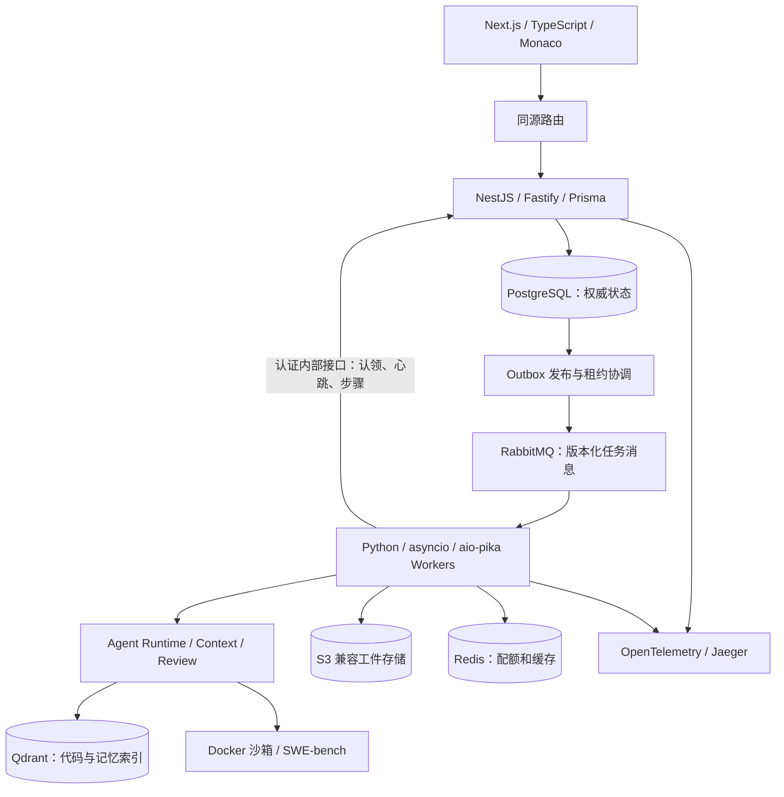

# RepoPilot 技术架构升级 v4

日期：2026-09-16。状态：规划，尚未实施。

**当前规划由本文与《RepoPilot_Coding_Agent完整规划_v3.md》共同组成。** Coding Agent 能力、沙箱、审批、记忆、Review 与 SWE-bench 评测要求沿用 v3；技术选型、服务边界和排期以本文为准。

## 1. 推荐的技术组合

**Next.js + TypeScript 前端；NestJS + Fastify 平台后端；Python Agent Worker；PostgreSQL + Prisma 事务数据层；Qdrant 向量检索；RabbitMQ、Redis、S3 兼容工件存储与 OpenTelemetry。**

这套组合使第二项目在前端应用架构、TypeScript 后端、跨语言执行与专用向量检索上形成明确增量。保持 AI Agent 开发实习定位，语言控制在 TypeScript 与 Python 两种。

“更先进”在这里指更适合复杂任务控制台、模块化业务服务和独立 Agent 运行层。Next.js 仍然基于 React，NestJS 不天然优于 FastAPI，Qdrant 也不替代关系数据库；面试需要说明为什么这些选择适合项目。

## 2. 与第一项目、v3 的差异

| 层次 | 第一项目 / v3 | v4 正式选型 | 新增能力 |
| --- | --- | --- | --- |
| 前端 | React/TypeScript 控制台 | **Next.js App Router + TypeScript** | 服务端/客户端边界、布局路由、首屏数据与实时状态协作 |
| UI | 原有控制台组件 | **Tailwind CSS + shadcn/ui + Monaco Diff Editor** | 可访问审批交互、代码 diff、任务工作台 |
| 平台 API | Python FastAPI | **NestJS + Fastify adapter** | 模块、依赖注入、Guard、DTO、平台状态与鉴权 |
| Agent 执行 | Python 循环 + Celery | **Python asyncio + Pydantic + aio-pika** | 跨语言任务协议、显式租约和步骤恢复 |
| 事务访问 | PostgreSQL 直接访问 | **PostgreSQL + Prisma + 显式 SQL migration** | 类型化访问、迁移、约束与必要的原生 SQL |
| 向量检索 | v3 计划 pgvector | **Qdrant + Python ast/ripgrep** | 专用向量库、payload 过滤、索引发布与失效 |
| 消息 | RabbitMQ/Celery 协议 | **RabbitMQ + 自定义版本化 JSON 消息** | TypeScript/Python 可共同理解的协议 |
| 缓存与限额 | Redis | **Redis 保留** | 共享配额与版本化缓存，职责不变 |
| 工件 | 本地文件 / S3 兼容存储 | **S3 兼容存储，本地 MinIO** | 文件与权威状态分离、校验和与恢复快照 |
| 观测 | 业务日志 / OTel 规划 | **OpenTelemetry + Jaeger** | TypeScript→消息队列→Python 的 trace 传播 |

不额外引入另一套后端语言。Go 的资源控制与并发、Java/Spring 的企业生态都有学习价值，但当前任务的主要目标是 Agent 开发。待目标转向相应后端岗位时再重新选择主语言。

## 3. 前端：做成可操作的 Agent 工作台

采用 Next.js App Router。稳定的页面骨架、布局与初始数据可在服务端完成；运行轨迹、审批、代码 diff、上下文用量等交互放在客户端组件。

正式依赖：

- **Tailwind CSS + shadcn/ui：**布局、表单、弹层、键盘操作与状态提示。组件库的使用不计作独立技术亮点。
- **TanStack Query：**客户端任务列表、详情、操作后的刷新和服务端数据缓存。
- **Monaco Diff Editor：**只读查看 base/candidate 差异和 review 位置；编辑仍由受约束的 Agent 工具完成。
- **SSE：**接收运行事件，以事件序号去重和断线续传；用户操作通过 HTTP API 发起。

首版页面集中为：项目/任务列表、任务工作台、项目记忆、评测结果。工作台内部包含轨迹、上下文、diff、审批和结果标签页。

Next.js 不再实现第二套任务状态机、审批 API 或队列生产逻辑。统一由反向代理将 `/api` 和事件流转发到 NestJS，避免为业务数据多加一层 BFF。鉴权由 NestJS 校验；服务端读取数据时显式传递用户身份。

用户任务、审批和项目记忆不使用公共缓存。服务端初始数据与 TanStack Query 的缓存边界写清楚；实时事件通过事件 ID 更新或失效对应查询，不能只在页面上乐观显示“已审批成功”。

Monaco 只在客户端加载。大 diff 首版按文件加载；虚拟化和复杂补丁编辑器留到测量有需要时再做。SSR 不作为 SEO 卖点，内部工作台主要收益是路由、布局与数据边界清楚。

**面试验收：**解释服务端组件与客户端组件的职责；演示刷新后任务持续存在、SSE 重连不丢事件、审批状态以服务端结果为准。

## 4. 平台后端：NestJS + Fastify

NestJS 负责平台业务，使用 Fastify 作为 HTTP adapter。选择它是为了模块化服务、依赖注入与统一生命周期；不预先宣称性能优于第一项目，性能需要在同口径下测量。

首版模块建议：

| 模块 | 职责 |
| --- | --- |
| Identity / Projects | 用户与项目访问范围、任务权限 |
| Sessions / Runs | 会话、任务、执行代次、生命周期 |
| Approvals | 动作与版本绑定、批准/拒绝/过期、重复提交处理 |
| Worker Control | 认领、租约、心跳、步骤提交、取消信号 |
| Events / Streaming | 事件持久化、SSE 续传与状态投影 |
| Memory / Index Registry | 记忆真值、版本、索引发布清单 |
| Artifacts / Evaluations | 工件元数据、评测运行与报告导入 |

这是一个模块化应用，可以部署 API 进程与后台发布/协调进程。首版不把每个模块拆成独立微服务。

平台的 RBAC 和项目访问过滤使用确定性服务逻辑与 Guard；DTO 校验只负责输入形状，不等于鉴权。不能仅通过在浏览器中隐藏按钮保护审批接口。

Fastify adapter 下需要核对 Cookie、SSE、文件上传与中间件兼容性，不能照搬所有 Express 示例。这里是实施前的兼容性检查项，并非已经完成的集成。

## 5. Python 保留为 Agent Worker，跨语言边界做清楚

Python 负责模型适配、工具循环、上下文压缩、代码分析、Qdrant 检索、沙箱控制、Reviewer 和 SWE-bench。SWE-bench 与大部分实验代码继续使用 Python，避免花主要时间重写已有评测生态。

**移除 Celery，改用 aio-pika 消费 RabbitMQ 上的版本化 JSON 消息。** Celery 本身可以用于这类系统，但有自身任务协议和生命周期；本项目已有自定义 Run/Attempt/Step、审批暂停与恢复语义，跨 TypeScript/Python 使用明确协议更直接。

这也带来真实开发成本：确认、有限重试、背压、心跳、消息去重和失联恢复必须自己实现并验证，不把 aio-pika 当作完整任务调度框架。

### 5.1 单一状态写入者

**PostgreSQL 业务状态与迁移由 NestJS 控制端负责。** Python Worker 不通过另一套 ORM 任意更新 Runs/Approvals 表。

Worker 使用内部认证接口认领任务、续租、提交步骤和完成结果。控制端从已认证 Worker 的权限与当前 Attempt 中核验身份，执行条件更新。Worker 不拥有替用户批准动作的接口权限。

RabbitMQ 承担任务分发与唤醒；内部 HTTP API 承担需要立即确认的状态提交。SSE 只从持久事件派生。这样消息队列、数据库、UI 的角色可以清晰解释。

### 5.2 一次执行的协议

1. NestJS 在事务内创建 Run 与 Outbox。
2. 发布器发送持久消息，收到 broker confirm 后更新 Outbox。崩溃可能导致重复投递。
3. Python Worker 收到消息，通过内部接口条件认领，获得 `attempt_id`、`generation`、租约和预算。
4. 成功认领后可以 ACK 分发消息；后续可靠性由持久 Attempt、心跳和失联协调器接管，而非依赖消息一直处于 unacked。
5. Worker 在执行工具前后提交步骤事件。接口按 `attempt_id + step_id + phase` 去重，并核对运行代次。
6. 完成、待审批、暂停等状态持久化成功后，Worker 结束本次执行。协调器对过期租约重新入队，恢复安全 checkpoint。

如果认领成功后、ACK 前崩溃，重复消息不会重复认领有效 Attempt；如果 ACK 后崩溃，协调器根据过期租约恢复。需要用故障实验验证这两个窗口。

暂时无法连接控制端时，Worker 不再启动新步骤或扩大权限；已开始的命令按沙箱上限收尾，并保留结果供核对。API 调用超时不代表状态未提交，重试沿用相同幂等键。

### 5.3 契约

消息至少包含 `schema_version / message_id / run_id / traceparent`。模型配置、权限、审批和预算由认领结果给出，不能相信任意队列消息中的“已授权”字段。

维护 OpenAPI 与 JSON Schema 契约，TypeScript DTO 和 Python Pydantic 模型通过相同样例与契约测试检查兼容。类型生成是辅助，运行时输入仍需校验。金额、时间、可空字段、未知枚举和版本升级都写明编码规则。

首版支持当前 schema 版本并明确拒绝未知主版本；不提前实现复杂的协议协商系统。

## 6. 数据库：保留 PostgreSQL，引入 Qdrant

数据库没有“换一种就一定升级”的排序。任务、审批和运行所有权需要事务与约束，PostgreSQL 很合适。MongoDB、TiDB 或其他数据库并不会自动提升这部分能力。

**本次升级采用职责分离：关系数据库保存权威状态，Qdrant 保存可重建的检索索引。**

| 系统 | 保存什么 | 一致性要求 |
| --- | --- | --- |
| PostgreSQL | 任务、步骤、审批、记忆原文、有效索引版本、工件引用、Outbox | 事务、约束、条件更新 |
| Qdrant | 代码片段/可检索记忆的向量与 payload | 可重建、允许受控延迟、按版本选择 |
| Redis | 模型并发租约、缓存与短期协调 | 不保存唯一的任务、授权或记忆真值 |
| S3 兼容存储 | 完整日志、patch、快照、评测报告与索引 manifest | 内容 hash、明确引用、失效与清理策略 |

### 6.1 PostgreSQL + Prisma 的进阶点

Prisma 负责常规类型化访问和迁移管理。运行代次更新、Outbox 竞争认领、部分唯一索引等数据库能力，可通过参数化原生 SQL 和受版本控制的 migration 实现，不把 ORM 当作理解 SQL 的替代品。

验证至少包括并发审批与认领、事务回滚、幂等键、慢查询计划和索引命中。事件量增长后再根据数据评估分区，不预先承诺分库分表。

### 6.2 Qdrant 的实现目标

- 使用固定 embedding 模型与维度；记录版本，切换模型时发布新索引。
- payload 至少包含项目、仓库、base commit、索引 generation、路径、符号、内容 hash 和适用 Attempt。
- 对实际检索过滤字段建立 payload index；租户/项目过滤在受信任服务端构造，模型不能自行删除过滤条件。
- 字面/符号检索与语义候选在代码层融合，保留基线。原生 sparse/hybrid 作为后期实验，不一开始叠加所有检索功能。
- 比较精确检索与 HNSW 的召回、延迟和内存；小数据量允许完整扫描，不为了使用 HNSW 构造不必要的数据规模。

专用向量库增加了服务与同步成本，在小语料上未必优于 pgvector。选择 Qdrant 的理由是将向量检索作为第二项目的独立工程模块，学习其过滤、索引与生命周期；性能优势以真实对照为准。

### 6.3 关系库与向量库如何同步

1. 以仓库快照、版本和内容 hash 生成确定性 point ID 与索引 manifest。
2. Index Worker 幂等构建 Qdrant 中的新 generation，确认预期向量写入并进行可查询检查。
3. 控制端核对 manifest 后，用条件更新发布当前有效 generation；旧或失联 Worker 无权覆盖新版本。
4. 查询只使用已发布 generation，同时回查代码内容 hash；缺失或过期证据回退到当前工作区的符号/字面读取。
5. 失败构建的 generation 不可见，稍后重试或清理；旧索引在没有引用后回收。

工作区修改使用基准索引加 Attempt 增量覆盖：先从基准候选中排除已变更/删除文件，再查询已发布的增量索引。新向量尚未就绪时，对这些文件使用当前内容检索，不能继续使用旧实现。

记忆原文与删除/停用状态以 PostgreSQL 为准。Qdrant 尚未清理的记忆候选需再次检查当前有效性，避免用户删除后仍被放进上下文。

这是有版本的最终一致性，不把跨 PostgreSQL/Qdrant 写入描述为单个 ACID 事务。

## 7. 最终架构



取消、审批、恢复等权威状态由控制端管理；执行动作仍由 Python runtime 的策略引擎和沙箱落实。后端与 Worker 之间双向验证协议，不能只在 UI 做限制。

## 8. 代码组织与质量检查

```text
apps/
  web/                 Next.js
  control-api/         NestJS / Fastify
packages/
  contracts/           OpenAPI、JSON Schema、协议样例
services/
  agent-worker/        Python runtime、索引、沙箱、评测
infra/
  compose/             服务定义与环境配置
```

TypeScript 部分使用 pnpm workspace，Python 部分使用 uv；初期不必加入 Nx/Turborepo，先避免重复职责和依赖漂移。

检查关注有实际风险的边界：TypeScript/Python 协议兼容、Prisma migration、任务状态竞争、审批目标版本、索引 generation 发布、SSE 重连，以及官方 harness 输出解析。前端用 Playwright 验证少量核心用户路径，Python 用 pytest 做运行层和故障测试；不为每个样式组件增加机械测试。

首版 Docker Compose 按 profile 启动控制台、执行与评测环境，Worker 并发和模型调用并发分开限额。Next.js、NestJS、Qdrant 等版本在实施阶段选择相容的稳定版本并锁定；本轮未进行版本兼容性实测。

## 9. 学习成本和新排期

v3 估计 30–40 个有效工作日。增加 NestJS 后端、跨语言协议和 Qdrant 索引同步后，按 **35–50 个有效工作日，约 7–10 周** 规划；每天约 4–6 小时，并包含代码理解、实验与面试练习。若 TypeScript 后端基础较弱，优先按上限安排。

| 阶段 | 时间 | 主要结果 |
| --- | --- | --- |
| M0 技术纵向验证 | 4–5 天 | Next.js→NestJS→RabbitMQ→Python→事件返回；少量 SWE-bench 环境预检 |
| M1 Agent 执行闭环 | 5–7 天 | Coder、工具、Docker、独立验收和 checkpoint |
| M2 上下文与数据层 | 7–10 天 | Qdrant 代码索引、版本发布、压缩、项目记忆 |
| M3 可靠调度与审批 | 8–11 天 | 两个 Worker、Outbox、租约、恢复、审批、Redis 配额 |
| M4 Review 与工作台 | 5–7 天 | 独立 Reviewer、Monaco diff、SSE、上下文视图、trace |
| M5 评测与面试 | 6–10 天 | 固定官方子集结果、故障矩阵、简历与现场修改练习 |

合计 35–50 天。第一阶段验证新增框架之间能否协作，再投入完整功能。MCP、Skill 扩展、会话 fork、复杂监控大屏继续排在核心完成之后。

## 10. 面试最终要证明的进步

项目一可以讲业务流程、检索质量、Redis 缓存与退款一致性。项目二可进一步讲：

- 为什么将 TypeScript 控制端和 Python 执行端分开，跨语言协议如何验证。
- Agent 长任务为什么不能仅靠一次 HTTP 请求或一条未确认消息存活。
- PostgreSQL 如何保证审批与状态一致性，Qdrant 索引如何处理延迟与过期。
- Next.js 工作台如何显示真实、可续传的任务状态，审批与 diff 如何绑定。
- 上下文压缩、项目记忆、Reviewer 是否提高了固定任务集的完成质量，代价是什么。

最终简历技术栈可以写：

> TypeScript / Next.js / NestJS / Python / PostgreSQL / Qdrant / Redis / RabbitMQ / Docker

Prisma、Fastify、Monaco、S3、OTel 放到相关实现条目或 README。完成后按照真实个人贡献和实验结果撰写，规划阶段不提前宣称已经掌握或完成。
