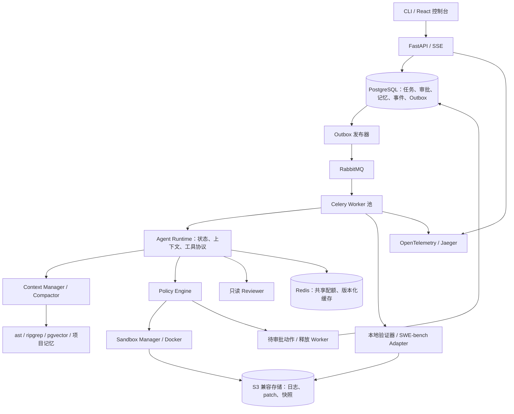

# RepoPilot：具备上下文、记忆、审批与评测能力的 Coding Agent

> 技术架构已升级：本文的 Coding Agent 功能与评测规范继续适用；框架、数据库职责、跨语言协议和排期以同目录《RepoPilot_技术架构升级_v4.md》为准。v4 采用 Next.js、NestJS/Fastify、Python Worker、PostgreSQL/Prisma 与 Qdrant，移除主方案中的 FastAPI、Celery 和 pgvector，工期调整为 7–10 周。

日期：2026-09-16。目标：AI Agent 开发实习为主，兼顾 Agent 平台与应用策略岗位。状态：规划，尚未实现。

本文为当前执行版本，取代同日 v1、v2 的定位、范围与排期。平台基础保留 v2 的进阶目标，进一步把 Coding Agent 的工作机制组织成完整产品。所有样本数、时间、配置均为计划，不是简历成果。

## 1. 项目定位与面试主线

**RepoPilot 是一个能够理解仓库、持续执行代码任务、接受人工干预，并交付可验证补丁的 Coding Agent 与任务运行平台。**

借鉴 Claude Code、Codex 的公开工作方式，首轮聚焦 Python 缺陷修复，同时提供只读分析和独立 diff review。用户可以启动任务、补充约束、查看上下文使用量、处理必要审批、中断或恢复任务，并检查补丁与验证结果。

第一项目 TicketPilot 展示受控业务工作流、检索、缓存和事务一致性。第二项目进一步展示：

1. **Agent 运行机制：**自主工具循环、上下文压缩、项目记忆、任务恢复。
2. **人机协作与执行边界：**只读/编辑模式、权限审批、沙箱、review、用户纠偏。
3. **平台工程：**队列、多 Worker、状态一致性、工件存储和跨进程观测。
4. **质量实验：**接入 SWE-bench 官方 harness，比较上下文和协作策略。

面试介绍优先讲“Agent 如何持续把任务做好”，技术栈围绕这条主线展开。CLI 是运行内核的入口，React 是查看与干预任务的界面，两者共用同一套运行层。

## 2. 借鉴哪些机制，做到什么程度

下表中的 RepoPilot 方案是本项目设计，不声称复刻两个产品的内部代码或全部行为。官方资料见文末。

| 借鉴方向 | RepoPilot 的具体交付 | 范围 |
| --- | --- | --- |
| Agent loop | 模型按观察选择搜索、读取、修改、测试；预算和状态由运行层管理 | 核心 |
| 上下文管理 | 固定指令、任务状态、按需代码证据、近期历史分区；显示各区预算 | 核心 |
| 自动压缩 | 先缩短旧工具输出，再生成结构化任务摘要；支持手动 compact | 核心 |
| 项目规则与记忆 | AGENTS.md 规则、可编辑项目记忆、来源和版本、按需加载 | 核心；自动归纳记忆为扩展 |
| Plan / Edit | Plan 只读分析；Edit 在已授权范围修改和测试 | 核心 |
| 沙箱与审批 | Attempt 独立容器；运行层 allow/ask/deny；具体动作审批后恢复 | 核心 |
| 会话持续工作 | 消息追加、步骤边界纠偏、暂停/恢复、安全 checkpoint | 核心；会话 fork 为扩展 |
| Code review | 对固定 diff 独立只读评审，输出带位置和证据的问题 | 核心 |
| 工具与扩展 | 统一 schema、错误分类、输出引用；小型 Skill 按需加载 | 小型 Skill 为第二阶段；一个只读 MCP 接口为扩展 |
| 评测接口 | 本地任务适配器 + SWE-bench 适配器 + 官方 harness 报告导入 | 核心 |
| 多任务运行 | RabbitMQ/Celery、两个以上 Worker、恢复和取消 | 核心 |

首轮暂不实现多语言 LSP、完整 IDE、任意桌面操作、多 Coder 共享写入、插件市场、自动合并、Kubernetes 集群或模型训练。

## 3. 一次任务的完整工作方式

```text
提交任务：仓库快照 + base commit + 问题 + 模式 + 预算
  → 固定仓库与环境，加载适用规则和项目记忆
  → 建立任务目标、验收条件、简短步骤状态
  → 组装当前上下文；按条件裁剪或压缩
  → 模型提出工具调用
  → 运行层校验：参数 / 工作区版本 / 权限 / 预算
      allow → 在隔离环境执行 → 结果入事件与工件 → 继续循环
      ask   → 保存待审批动作与 checkpoint → 释放 Worker → 等待用户
      deny  → 返回结构化原因 → 换方案或受控退出
  → 提交候选 patch
  → 按需 Reviewer 提出问题 → Coder 有限修订
  → 干净环境独立验证 → 交付 patch、测试报告、轨迹与成本
```

这里的“计划”是可查看、可更新的任务步骤与完成条件，不要求模型输出内部思维链。模型可根据测试反馈调整步骤，运行层负责约束可执行动作与最终状态。

首版只在安全步骤边界接收用户纠偏；执行中的测试可取消，但不承诺任意 shell 进程能够无损暂停。用户补充的新约束追加为事件，并使相关旧计划、候选 patch 或审批失效后重新核对。

## 4. 上下文管理与压缩：第一项重点深挖

### 4.1 四种数据分别处理

| 数据 | 解决什么问题 | 内容与存储 | 不能混淆的地方 |
| --- | --- | --- | --- |
| 模型上下文 | 本次调用需要知道什么 | 当前指令、状态、代码片段、近期交互 | 只是完整运行记录的一个视图 |
| 项目记忆 | 下次任务有哪些经验可复用 | 项目偏好、非显然约定、已验证注意事项；PostgreSQL，支持 Markdown 导入导出 | 记忆不是当前代码或授权的真值 |
| 执行 checkpoint | 中断后从哪里安全续跑 | 步骤位置、代次、预算、工作区快照引用、待审批动作 | 仅保存聊天摘要无法恢复运行 |
| 事件与工件 | 怎样审计、取回证据和重新组装上下文 | 全量工具记录、日志、patch、测试报告；PostgreSQL + S3 兼容存储 | 回放记录不应重放副作用 |

### 4.2 上下文组装

固定层保留运行规则、适用项目指令、最新用户约束和当前任务目标；状态层保留已完成步骤、当前 diff、最新失败和待办；证据层按需加入代码与日志；历史层保留近期完整交互。

代码按 Python ast 的函数/类边界建索引，结合路径、符号、错误栈、字面与 pgvector 向量检索。基准索引按 commit 固定，修改文件使用 Attempt 增量覆盖层，过滤已替换或删除的旧片段。上下文中的代码引用携带内容 hash，使用前能识别过期内容。

每次调用计算预算：模型窗口减去预留输出、协议/工具定义和安全余量，再决定可容纳的输入。使用对应 tokenizer 或明确标记的保守估算；记录估算与 provider usage 的差异。触发阈值按模型配置，不能写死为所有模型统一的 token 数。

### 4.3 分层压缩流程

1. 工具结果先限长。完整输出进入工件存储，当前上下文保留错误摘要、必要片段及可回读引用。
2. 去掉被更新版本覆盖的旧代码、重复检索和旧测试日志，保留近期完整的工具调用—结果配对。
3. 仍接近预算时，对较早交互生成结构化摘要：`goal / constraints / decisions / attempted_changes / latest_test / unresolved / evidence_refs`。
4. 将摘要与确定性状态合并。当前权限、审批、预算和文件版本从数据库重载，不能从模型摘要恢复。
5. 校验 schema、证据引用和版本；缺证据的判断标为待核实。摘要可能失真，关键结论通过回读代码/日志确认。
6. 保存 `compaction_event`，包含覆盖事件范围、摘要版本、压缩前后输入估算与摘要调用成本。原始事件保持可追溯。

压缩调用也有输入与输出上限；超长历史按有界片段处理，避免在已经超窗时把全量历史再发给摘要模型。摘要失败时采用确定性裁剪和回读方式；限制连续压缩次数，防止“压缩—重新塞满—再压缩”的循环。

**验收：**构造长日志、关键约束出现在早期、代码多次变化等任务，验证压缩后没有丢掉目标和限制，引用能回查，工具调用配对有效。比较近期截断、结构化状态、结构化状态加压缩；统计修复结果、约束保留、重复读取、总 token 与额外耗时。

压缩能减少后续输入，但可能损失线索或打破 provider 的前缀缓存；最终报告总调用成本，不能把压缩率直接当作成本收益。

## 5. 项目规则与记忆：第二项重点深挖

### 5.1 项目规则

实现精简的 AGENTS.md 加载器：仓库根规则先加载，访问子目录时加载其适用规则，保存来源、路径范围和内容 hash。只读取任务仓库范围，设置字节预算，明确展示实际加载了哪些文件。

项目规则提供构建方式、测试约定和编码偏好；其优先级低于平台硬策略与用户授权。仓库内“关闭沙箱”“跳过评分”等文本不能改变执行权限。首版无需兼容产品的全部 fallback、import 与配置继承细节。

### 5.2 记忆的最小闭环

支持用户显式保存或确认一条经验，按用户/项目隔离。记忆记录 `scope / content / source_run / evidence_refs / base_commit / confirmed_at / validity`，支持查看、编辑、停用和删除。

例子：项目测试需使用固定配置、某种边界情况容易被遗漏、用户偏好最小范围修改。能直接从当前源码读取的函数内容无需长期复制为记忆。

启动时加载一个有界索引，再按任务检索少量相关记忆；运行前验证测试命令等易变化事实。与当前代码或用户新指令冲突时，以当前事实和指令为准，并将旧记忆标为待复核。

首版仅实现显式/确认式记忆。扩展阶段可让 Agent 在成功任务后提出记忆候选，附来源并合并重复项；不能把一次猜测自动升级为长期规则，也不能把一次动作审批写成永久授权。

**验收：**新任务能加载同项目记忆、其他项目不可见、停用后不再召回、基准变化后能识别过期信息。SWE-bench 默认关闭跨实例记忆写入与读取，防止评测结果或答案流向后续任务。

## 6. 沙箱、模式和审批：第三项重点深挖

沙箱规定技术上能访问哪些文件、网络和资源；审批策略决定一个具体动作是否可以执行。两者都由模型外的代码落实。

### 6.1 三种运行配置

| 模式 | 默认能力 | 超出范围的处理 |
| --- | --- | --- |
| Plan | 搜索、读取、分析；只读挂载源码，不提供写工具或任意 shell | 用户明确切换到 Edit 后才允许修改 |
| Edit | 在任务私有工作区编辑、运行预配置测试，默认断网 | 对受支持的额外能力申请具体审批 |
| Benchmark | 固定工具、镜像、资源与策略，无交互人工帮助 | 被拒绝的动作受控返回；需要外部介入记为失败原因 |

用户已经授权修复任务后，正常工作区编辑与测试不逐次询问。第一项目已有审批流程；此处的进阶是“任意工具动作”与变化中的工作区如何绑定授权。

### 6.2 可执行的审批边界

首版审批演示选择一个能够精确执行的动作：将最终 patch 应用到用户指定的目标 checkout。UI 展示目标路径、完整 diff、预期 base hash、影响文件，批准后由宿主侧受限 patch 应用服务核对版本并执行。Agent 本身仍不能访问任意宿主路径。

后续可增加受限依赖准备或特定网络访问，只有底层能实际限制命令和目标时才开放。首版不靠 shell 前缀或正则黑名单声称能控制任意脚本能力；批准动作也不会自动解除全部沙箱限制。

审批对象包含任务、动作 ID、规范化参数摘要、工作区/目标版本、权限范围、有效期和用户决定。参数变化、目标文件变化、用户新增约束或过期都要求重新判定，避免审批旧 patch 后执行新 patch。

待审批时持久化 `WAITING_APPROVAL`、动作与 checkpoint，结束当前 Worker 占用。批准事件通过事务与 Outbox 再入队，按唯一约束消费；拒绝后由 Agent 换方案或明确结束。等待用户的时间与活跃执行时间分开，任务总存续期仍有上限。

对应用 patch 的外部副作用设置幂等记录，失败后先核对目标状态，不能直接重试。保留目标原有修改，只在可确认匹配的内容上应用补丁。

### 6.3 沙箱实现

每个 Attempt 独立 Docker 容器和仓库副本，非 root、无特权、无 Docker socket、无模型凭据；限制 CPU、内存、进程数、时长与输出。网络默认关闭，依赖在可信环境准备阶段固定。

宿主侧沙箱管理器持有容器管理权限，模型只能调用声明过的工具；日志回传不暴露宿主环境变量。路径规范化和符号链接检查配合挂载边界，不能只依赖字符串检查。

仓库中的测试本身也会执行代码，因此测试必须在沙箱内运行。安全实验覆盖路径越界、超时、资源耗尽、仓库文本诱导越权和审批过期；同时保留正常样例验证不过度拦截。

## 7. Review、独立验收与有限协作

提供独立的 Review 入口，也允许 Coder 在准备交付时请求一次 review。Reviewer 使用独立上下文，看到固定 base、候选 diff、必要源码、任务要求与开发测试证据，不继承 Coder 的全部推测历史。

输出结构为 `file / line / severity / finding / trigger / evidence / suggestion`。反馈必须对应候选版本中的真实位置，可为空；优先报告可触发的正确性和回归问题。Reviewer 只读，权限由运行层限制。

Coder 根据反馈有限修订，默认最多两轮作为可调上限。每次修改后旧 review 标为过期；Coder 和 Reviewer 共用预算。首版仅双角色，由确定性状态机调度，不实现自由组队或多写入者合并。

独立上下文不保证独立判断，同一模型仍可能有共同盲区。对带已知缺陷的补丁和干净补丁分别评估捕获情况与误报，不能用“review 通过”替代修复成功率。

最终验收在新的干净环境应用候选 patch，检查缺陷测试、回归测试和测试是否实际执行。隐藏测试、参考 patch、评分代码不进入 Agent 可见环境。自建任务由本地验证器判断；SWE-bench 以其官方 harness 结果为准，不能用自建规则替代官方评分。

## 8. 可类比补充的能力：控制在小范围

| 能力 | 为什么有用 | 首版实现与边界 |
| --- | --- | --- |
| 工具执行状态 | 测试可能超出一次调用时间 | `start / poll / cancel`，返回执行 ID；限制进程和日志，不做完整终端模拟器 |
| 任务纠偏 | 用户在运行中补充约束 | 消息入队，在安全步骤边界读取；终止不再适用的计划 |
| 工作区 checkpoint | 修复走错方向后能够回退 | 保存任务私有文件变化与恢复点，只回退本 Attempt；不能撤回外部 API 副作用 |
| 循环检测 | 相同失败反复尝试消耗预算 | 根据动作、工作区版本和结果指纹检测；反馈后仍重复则退出 |
| 轻量 Skill | 测试失败排查等流程可以复用 | 2–3 个固定工作流，先加载描述、按需读正文；不允许 Skill 修改权限 |
| 生命周期事件 | 测量和约束需要稳定入口 | 固定 `before_tool / after_tool / before_finish` 代码接口；不执行仓库提供的任意 hook 脚本 |
| 工具扩展 | 展示协议接入与复用 | 后期只读代码检索 MCP，复用原权限、预算和日志；不做插件市场 |

其中工具状态、纠偏、checkpoint、循环检测纳入核心。Skill、MCP、会话 fork 按主线完成情况扩展，不为其延迟主项目验收。

## 9. 平台架构与技术栈



| 技术 | 明确职责 |
| --- | --- |
| Python / FastAPI / Pydantic | API、工具协议、可讲解的显式状态机与 Agent loop |
| PostgreSQL | Session/Run/Attempt/Step、审批、记忆、事件与 Outbox 的权威状态 |
| RabbitMQ + Celery | 跨进程任务分发、有限重试；业务恢复由运行层与协调器负责 |
| Redis | 跨 Worker 模型并发配额、短期信号、包含工作区版本的缓存 |
| pgvector + ast + ripgrep | 代码证据定位、持久索引与增量覆盖；先精确向量检索，再依据测量决定 HNSW |
| Docker / Git | 执行与验收环境、基准快照、任务私有改动 |
| S3 兼容存储，本地选 MinIO | 大日志、patch、检查点文件和结果包；数据库只保存元数据与校验和 |
| OpenTelemetry / Jaeger | API—队列—Worker—模型/工具/验证跨进程 trace |
| React / TypeScript / SSE | 任务状态、上下文用量、审批、diff、记忆、结果查看 |
| pytest / SWE-bench harness / Compose / CI | 系统故障验证、官方任务验收与环境复现 |

Prometheus/Grafana 在核心 trace 后补充队列与资源指标，可最后完成图表。RabbitMQ、共享 Redis、pgvector、工件存储和多 Worker 保持正式目标，防止第二项目重新退回单机小脚本。

参考 mini-swe-agent 的精简循环与可运行基线；实施时固定 commit 和许可证，明确复用哪些模型/环境适配。个人贡献围绕运行层与验证，不能将上游已有功能重复计入。

## 10. 持久化、恢复与并发的关键协议

数据层区分 `Session`（连续交互）、`Run`（一次目标）、`Attempt`（一次实际执行代次）、`Step`（工具/模型步骤）。同时记录 `ContextSnapshot`、`Approval`、`MemoryEntry`、`Artifact`、`Review` 与 `EvalRun`，不必全部拆成服务。

任务与 Outbox 在同一事务创建；发布器收到 broker confirm 后标记，重复投递由 Worker 条件认领处理。Attempt 使用租约和递增 generation，旧 Worker 无权提交当前权威状态；每个 Attempt 拥有独立沙箱和工件前缀。

状态包含 `QUEUED / RUNNING / WAITING_APPROVAL / PAUSED / REVIEWING / VERIFYING` 和明确终态。协调器扫描失联租约，基于安全 checkpoint 恢复；审批等待、人工暂停不占着 Worker 长期 sleep。

模型和工具调用先记录意图再记录结果，工具结果不明时先核对，无法确定则恢复安全快照并标记不确定性。允许隔离计算重做，不承诺恰好一次调用。Redis 配额失败时采用保守限流或明确失败；不能把不可用记成无限额度。

取消通过数据库状态和容器管理器配合完成，条件更新处理取消与完成竞争；后台清理检查孤儿容器和工件。SSE 从持久事件序号续传，通知丢失后可重新查询。

在至少两个 Worker 进程/容器上演示重复投递、发布后退出、失联恢复、审批重复回调、旧版本审批失效、取消竞争和资源回收。单机多容器结果按真实环境表述。

## 11. SWE-bench 接入：从第一阶段就打通

本版将用户提到的 “SWE workbech” 按 SWE-bench 理解。若之后提供的是另一套具体 workbench，则另加适配器；当前不声称已经兼容未核实的项目。

### 11.1 两层 harness 的职责

**RepoPilot runtime** 让模型获得上下文、调用工具并生成 patch；**SWE-bench evaluation harness** 在规定环境中评判 patch。两者通过任务适配器和预测文件衔接，不能把“自带 pytest 跑通”叫作接入 SWE-bench。

选择 SWE-bench Lite 开始。M0 先验证 Docker、磁盘、依赖和 1–3 个实例的评分流程，生成侧先用 mini-swe-agent 或 RepoPilot 最小循环。必要时用官方参考补丁做评分环境自检，该补丁只在可信验收侧，绝不进入 Agent 的文件、Git 历史、上下文或记忆。

### 11.2 适配器协议

输入将 `instance_id / repo / base_commit / problem_statement` 转为任务，单独记录镜像和数据集版本。Agent 仅能看到允许的缺陷前源码、问题说明和开发环境；测试 patch、参考答案及评分实现保留在验证端。环境适配失败时单独报告原因，不能退化为任意镜像后宣称与官方可比。

输出为官方 JSONL 预测格式，每行包含：

```json
{"instance_id":"<dataset-instance-id>","model_name_or_path":"<model-and-config-id>","model_patch":"<unified-diff>"}
```

由官方 `swebench.harness.run_evaluation` 读取预测并评测。以下仅为计划中的运行模板，本轮未执行：

```bash
python -m swebench.harness.run_evaluation \
  --dataset_name princeton-nlp/SWE-bench_Lite \
  --predictions_path predictions.jsonl \
  --instance_ids <fixed-instance-ids> \
  --max_workers 1 \
  --run_id <unique-eval-run-id>
```

命令在已配置的 Linux/WSL2 或 Linux 主机环境内运行，Windows 端保留控制台。安装与实施时固定 harness 版本，再核对该版本参数、环境与结果 schema。前期 `max_workers=1` 验证资源消耗，之后再扩并发。

适配器导入官方 `report.json`、测试日志、patch 和实例结果，区分 resolved、unresolved、empty patch、environment/error 等状态；若该版本有 FAIL_TO_PASS / PASS_TO_PASS 明细则一并展示。进程退出码为 0 不等于全部任务 resolved。

每个策略、补丁版本和重复试验使用唯一 `run_id`，并记录 patch hash；官方结果缓存可能按 run_id/instance_id 复用，不能用同一运行标识误拿旧分数。

### 11.3 规模与公平性

先 3 个实例冒烟，再冻结 20–30 个实例作为最终子集目标，另设约 10 个不重叠开发任务。根据环境预检、仓库和缺陷族确定子集，不能观察模型修复成绩后挑题；保存筛选与排除列表。

不要求首轮跑完整 Lite 或完整榜单。结果写为“固定 SWE-bench Lite 子集，X/N resolved”，列出模型、预算、任务 ID、环境和时间，不能宣传完整官方榜单排名。

Benchmark 模式无人工审批帮助、无针对测试任务的记忆、无隐藏测试反馈回流后再次修改参赛 patch。每次候选生成只利用开发测试，最终官方验收结果用于报告。调优使用开发集；若依据冻结集修改策略，该集合应改称开发数据，并另设未使用的验收集。

## 12. 三层评测与证据

| 层次 | 数据与方法 | 回答什么问题 |
| --- | --- | --- |
| 系统可靠性 | 假模型、可控工具、两个 Worker、故障注入 | 状态、审批、取消、恢复和资源释放是否符合协议 |
| Agent 机制 | 长日志、过期记忆、旧索引、权限诱导、已知问题 diff | 压缩、记忆、review 是否产生预期行为，是否误伤正常任务 |
| 端到端修复 | 固定 SWE-bench 子集 + 官方 harness | 最终代码是否满足基准验收，以及成本如何 |

消融按顺序进行，避免所有模块做全排列：

1. 固定工具、模型与预算，比较近期截断与结构化上下文；再测试增加自动压缩。
2. 检索对比先在开发集评估符号/字面基线与增加向量召回，仅把必要方案带入最终对照。
3. 固定总预算，比较单 Coder 与按需 Reviewer。额外预算实验单列，不能混淆调用量与协作收益。
4. 记忆另设重复项目任务和过期信息测试，不与禁止跨实例记忆的标准 benchmark 混在一起。

保留所有尝试与失败原因，报告 resolved 个数/冻结总数、模型调用数、总 token、活跃耗时、排队耗时和费用估算；摘要、review 和重试均计入成本。usage 缺失记为未知。环境失败既分类说明，也不能从主要分母中无说明地删除。

公开任务可能存在模型训练污染，小子集也有统计波动；结论限定为所测配置和任务。假模型的调度吞吐与真实模型的修复表现分开报告。

## 13. 实施计划：6–8 周

本版增加了实际压缩、记忆、审批和官方评测适配，按 **30–40 个有效工作日** 估算，每周约 5 天、每天 4–6 小时，包括阅读与面试练习。若环境搭建或任务复现耗时超出估计，以里程碑验收为准。

| 阶段 | 投入 | 必须交付 | 本人掌握要求 |
| --- | --- | --- | --- |
| M0 基线与评测预检 | 3–4 天 | 固定上游；1–3 个 SWE-bench 实例链路；任务/工具协议 | 解释 runtime 和 evaluation harness 的区别 |
| M1 执行内核 | 5–6 天 | Coder loop、工具 start/poll/cancel、Docker、checkpoint、独立验收 | 画出状态机，现场修改一个工具 |
| M2 上下文与记忆 | 6–8 天 | ast/pgvector 增量索引、Context Manager、Compactor、规则和显式记忆 | 演示压缩保留约束、旧信息失效 |
| M3 审批与平台运行 | 7–9 天 | Plan/Edit/Benchmark、审批恢复、Outbox/RabbitMQ/Celery、多 Worker、Redis 配额 | 解释重复消息、版本审批、失联恢复 |
| M4 Review 与展示 | 4–5 天 | 独立 Reviewer、有限修订、SSE 页面、OTel trace | 解释误报、协作成本、定位慢步骤 |
| M5 冻结实验与面试 | 5–8 天 | 固定子集官方报告、故障矩阵、失败案例、简历和演示 | 不看 README 深挖并现场修改 |

合计 30–40 天。每个阶段都有可运行产物；第一周先确认评测能接入，随后扩内核。轻量 Skill、MCP、fork 和额外监控面板仅在核心时间可控时增加。

## 14. 演示与简历的组织

最终演示围绕一条修复任务：加载项目规则 → 查看计划与上下文 → 自主搜索修改 → 长日志触发压缩 → Reviewer 指出问题 → 修订与独立验收 → 展示 diff → 对应用 patch 的具体动作进行审批。另用短场景演示 Worker 中断恢复和 SWE-bench 报告导入，不强行把所有故障塞进一次运行。

面试至少准备五个可追问问题：

- 压缩后如何保证重要约束还在？哪些状态必须从数据库重载？
- 记忆与检索结果过期如何发现？为什么标准评测关闭跨任务记忆？
- 批准了一个动作，为什么还需要沙箱和版本校验？
- Worker 死在工具执行之后、结果落库之前怎么办？
- Reviewer 和官方测试分别证明什么？如何判断压缩或协作值不值得？

完成后简历保留四条主线：**Coding Agent 执行闭环；上下文与记忆；可靠调度与权限沙箱；review 与 SWE-bench 评测。** 中间件围绕具体问题出现，核心指标采用真实任务数、resolved 个数、故障行为和一两组成本/质量对照。

**收口要求：**自主修复可运行；上下文超长可继续且可追溯；项目记忆可管理；审批绑定具体动作且能恢复；两个 Worker 的中断/重复投递经验证；review 有定位与证据；SWE-bench 官方 harness 真正接通；本人能解释并修改核心实现。

## 15. 已核对的官方参考

检索日期：2026-09-16。借鉴公开机制，RepoPilot 的具体数据结构、阈值、状态和技术选型由本文自行设计。

- [Claude Code：How Claude Code works](https://code.claude.com/docs/en/how-claude-code-works)：上下文—行动—验证循环、工具、会话、上下文压缩、checkpoint 和权限的公开说明。
- [Claude Code：Memory](https://code.claude.com/docs/en/memory)：项目指令、跨会话记忆、按需加载和记忆管理；规则文本与硬权限层职责不同。
- [Codex：AGENTS.md](https://developers.openai.com/codex/guides/agents-md/)：分层项目指令、来源和加载范围。
- [Codex：Agent approvals & security](https://developers.openai.com/codex/agent-approvals-security)：沙箱技术边界、审批策略和网络访问的分工。
- [Codex：Code review](https://developers.openai.com/codex/code-review)：针对指定 diff 的只读 review、带位置的问题反馈与后续修订。
- [SWE-bench：Evaluation Guide](https://www.swebench.com/SWE-bench/guides/evaluation/)：官方 harness、预测 JSONL、实例子集、结果文件与 run_id 缓存注意事项。

本轮只更新规划，未启动模型评测、安装中间件或修改项目代码。
